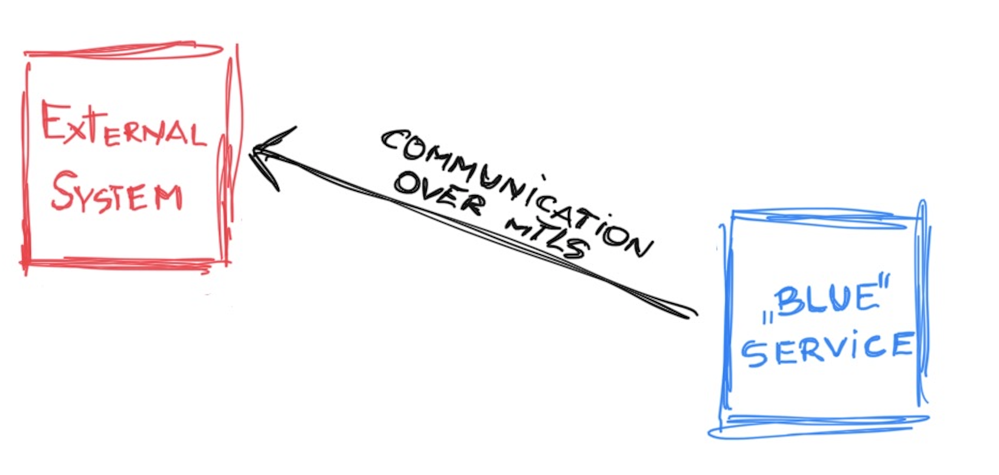
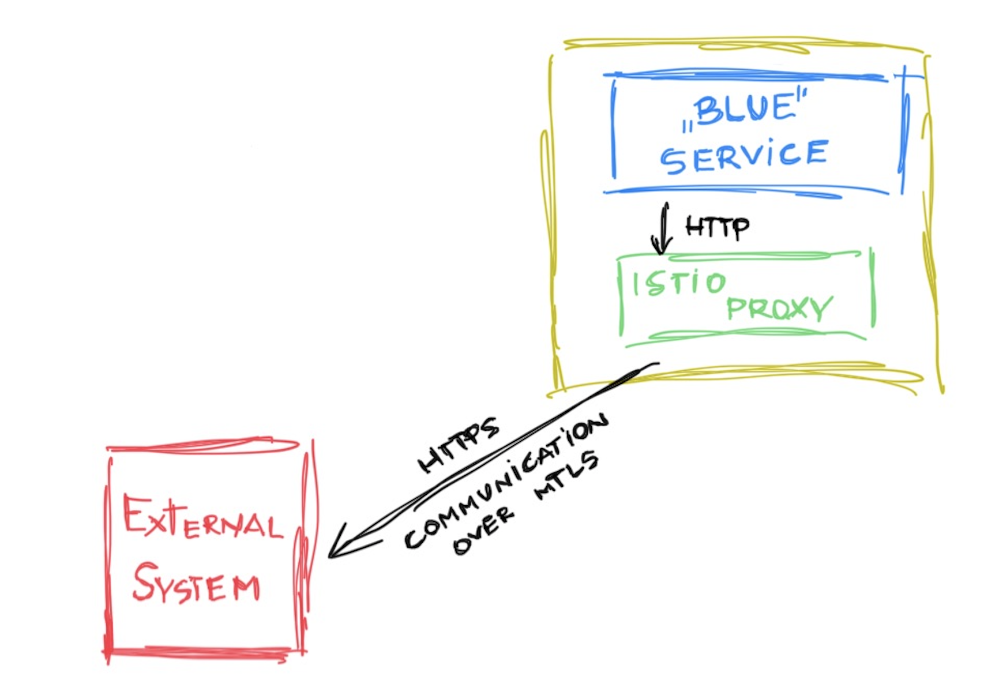
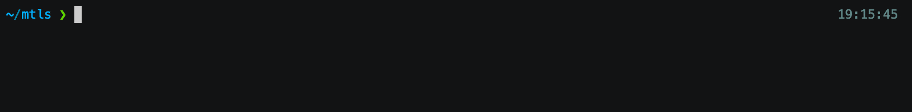
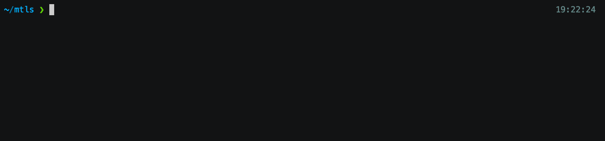
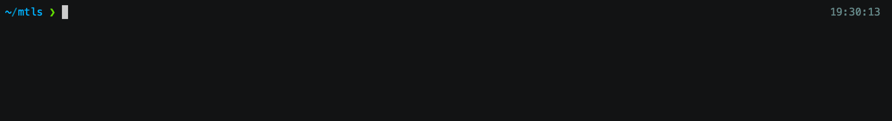

Have you ever wondered if you can move the implementation related to communication over mTLS from the code level to a higher layer of abstraction? In this article, I will try to show you one approach on how to make your codebase lighter.

***Note: The code samples will be based on Java, Spring Boot and Istio***

### [The case!](#the-case)

You've got service with business logic and some external system for which communication has to be established over mTLS connection.



In the picture above, there is an external service (the "red" one) managed by a third party to which we should perform requests using mTLS. On the other hand, service "blue" is managed by your team where you are responsible for providing the implementation of a secured connection to the external system.

### [First approach](#first-approach)

The first solution that comes to our mind is to handle such a connection directly from the code. In this case, you create a dedicated HTTP client and supply it with all required data - such as keystore (with client certificate and private key), truststore (with server certificates), or a protocol version. 

Sample solution of RestTemplate for handling mTLS connection can look like:

```java
@Bean("externalServiceRestTemplate")
RestTemplate restTemplate(RestTemplateBuilder restTemplateBuilder) {
    return restTemplateBuilder
            .requestFactory(this::requestFactory)
            .build();
    }

private ClientHttpRequestFactory requestFactory() {
    try {
        final KeyStore keyStore = KeyStore.getInstance("PKCS12");
        keyStore.load(keyStoreResource.getInputStream(), keyStorePassword.toCharArray());
        KeyStore trustStore = KeyStore.getInstance("JKS");
            trustStore.load(trustStoreResource.getInputStream(), trustStorePassword.toCharArray());

        final SSLConnectionSocketFactory socketFactory =
                new SSLConnectionSocketFactory(
                        new SSLContextBuilder()
                                .loadKeyMaterial(keyStore, keyStorePassword.toCharArray())
                                    .loadTrustMaterial(trustStore, new TrustSelfSignedStrategy())
                                .setProtocol("TLSv1.2")
                                .build());

        final HttpClient httpClient = HttpClients.custom()
                .setSSLSocketFactory(socketFactory)
                .build();
        final ClientHttpRequestFactory requestFactory = new HttpComponentsClientHttpRequestFactory(httpClient);
        return requestFactory;
    } catch (Exception e) {
        e.printStackTrace();
        throw new IllegalStateException("Could not create client request factory");
    }
}
```

As you can see there is a lot of data such as files and passphrases which is needed to be passed directly to your source code (e.g. via K8S secrets, FlexVolumes, AWS Secret Manager, etc.). 

Then calling the destination service is based on wiring a correct instance of RestTemplate and performing the HTTPS request.

```java
@Autowired
@Qualifier("externalServiceRestTemplate")
private RestTemplate restTemplate;

@GetMapping("/client-endpoint")
private ResponseEntity<String> clientEndpoint() {
    LOGGER.info("Received request. Calling server via mTLS");
    String response = restTemplate.getForObject("https://external.system.com/secured-endpoint", String.class);
    LOGGER.info("Received response from external server {response={}}", response);
    return ResponseEntity.ok(response);
}
```

### [Service mesh to the rescue!](#service-mesh)

In this article I will not dive into the concept of what Service Mesh is. If you are not familiar with that term, I recommend you [this article by William Morgan](https://buoyant.io/service-mesh-manifesto/)

The example below is based on Istio, which is one of the leading open source service mesh implementations. If you are interested in Istio [jump to their documentation and get familiar with sample **BookInfo** application](https://istio.io/latest/docs/setup/getting-started)

The idea behind this solution is to move the responsibility for establishing a connection via mTLS to the layer outside our application. Let's let **Istio** do it!

The figure below shows a simplified explanation of how it will work. We've got our service, in front of it there is an istio-proxy container. It will be responsible for handling a mTLS communication in our case. 

Our service will call the external system as a normal HTTP system and the proxy will upgrade the connection to HTTPS and handle stuff related to mTLS.



The configuration is as simple as it can. 

Follow these steps:

1. Create a secret in K8S cluster, which contains required data. The structure of secret should look like:

    ```yaml
    apiVersion: v1
      kind: Secret
      type: Opaque
    metadata:
      name: external-system-mtls-data
      namespace: $YOUR_NAMESPACE
    data:
      cert: $CLIENT_PEM_CERTIFICATE_IN_BASE64
      key: $CLIENT_PEM_KEY_IN_BASE64
      cacert: $TRUSTED_CERTIFICATE_PEM_IN_BASE64
    ```
    and then apply it:

    

2. Add resources specific for Istio:
    * [ServiceEntry]
(https://istio.io/latest/docs/reference/config/networking/service-entry/) - describes the API which is external to the mesh 
    * [VirtualService](https://istio.io/latest/docs/reference/config/networking/virtual-service/) - routes the traffic to external system on port 80 (http) to port 443 (http to https)
    * [DestinationRule](https://istio.io/latest/docs/reference/config/networking/destination-rule/) - defines a policy to apply mTLS when traffic is routed to the external system and specifies the directory of certificates to use
    ```yaml
    #ServiceEntry--
    apiVersion: networking.istio.io/v1alpha3
    kind: ServiceEntry
    metadata:
      name: external-system-service-entry
      namespace: project
    spec:
      hosts:
        - external.system.com
      location: MESH_EXTERNAL
      ports:
        - number: 80
          name: http-port
          protocol: HTTP
        - number: 443
          name: https-port
          protocol: HTTPS
      resolution: DNS
    #DestinationRule
    apiVersion: networking.istio.io/v1alpha3
    kind: DestinationRule
    metadata:
      name: external-system-dest-rule
      namespace: project
    spec:
      host: external.system.com
      trafficPolicy:
        portLevelSettings:
          - port:
              number: 443
            tls:
              mode: MUTUAL
              clientCertificate: /etc/mtlsfiles/cert
              privateKey: /etc/mtlsfiles/key
              caCertificates: /etc/mtlsfiles/cacert
              sni: external.system.com
    #VirtualService
    apiVersion: networking.istio.io/v1alpha3
    kind: VirtualService
    metadata:
      name: external-system-virtual-service
      namespace: project
    spec:
      hosts:
        - external.system.com
      http:
        - match:
            - port: 80
          route:
            - destination:
                host: external.system.com
                port:
                  number: 443
    ```
    

3. Adjust your deployment to mount files with certificates. For these purposes, the annotations `sidecar.istio.io/userVolume` and `sidecar.istio.io/userVolumeMount` are used.
  Below you can find a sample deployment with applied changes. 

    ```yaml
    apiVersion: apps/v1
    kind: Deployment
    metadata:
      namespace: devel
      name: sample-app
      labels:
        app: sample-app
    spec:
      replicas: 1
      selector:
        matchLabels:
          app: sample-app
      template:
        metadata:
          annotations:
            sidecar.istio.io/inject: "true"
            sidecar.istio.io/userVolume: '[{"name":"external-system-mtls-data","secret":{"secretName":"external-system-mtls-data"}}]'
            sidecar.istio.io/userVolumeMount: '[{"mountPath":"/etc/mtlsfiles","name":"external-system-mtls-data","readonly":true}]'
          labels:
            app: sample-app
        spec:
          containers:
          - name: sample-app
            image: your-application-image:latest
            resources:
              requests:
                memory: 300Mi
                cpu: 500m
              limits:
                memory: 450Mi
                cpu: 750m
    
    ```

    Notice that in  `sidecar.istio.io/userVolume` the name of secret created in Step 1 has to be used. In `sidecar.istio.io/userVolumeMount` path for volume mount must be consistent with one provided in definition of DestinationRule. 

4. Verify the configuration.

    First of all you can verify that your certificates are correctly mounted. To do that, just go inside your pod and verify files under the configured directory.

    

    Next, it is time to verify the handling of mTLS connection. Now execute the **HTTP** request to the external system inside an application container.

    

    **Voilà!** HTTP call is proxied via sidecar and mTLS connection established successfully on top of that. 

5. Adjust your application code. In my example application code will be simplified to:

    ```java
     @Autowired
     private final RestTemplate restTemplate;
   
     @GetMapping("/client-endpoint")
     private ResponseEntity<String> clientEndpoint() {
         LOGGER.info("Received request. Calling server via mTLS");
         String response = restTemplate.getForObject("http://external.system.com/secured-endpoint", String.class);
         LOGGER.info("Received response from external server {response={}}", response);
         return ResponseEntity.ok(response);
     }
    ```
    Without any special configuration of `RestTemplate` - just simple HTTP call to destination service.

### [Summary](#summary)
It was quite simple to achieve moving the implementations from the application code to the service mesh. Thanks to that, it is transparent for our application to know how the connection is secured. The application's codebase is easier to understand and independent from external system security requirements. 

Istio provides also an easy way to implement other patterns typical for microservices such as retry policies, circuit breaking, or API versioning. 

If you have any thoughts or questions feel free to comment. The code samples can be found on my GitHub account.

